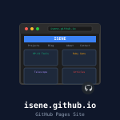

# My web presence

[](https://unlicense.org/)
[](https://github.com/isene/isene.github.io/stargazers)
[](https://isene.org)


<br clear="left"/>

This is the repository for my website at [isene.org](http://isene.org).

Feel free to post feedback as issues in this repo.

## How it is built

No Jekyll. `build.py` turns the Markdown posts in `_posts/` and the pages
at the top into plain HTML in `_site/`, inside the frame in `template.html`.
Everything else is copied as it is.

```
pip install markdown-it-py pyyaml pygments
python3 build.py
python3 -m http.server -d _site 8000
```

A push to `master` runs the same build on GitHub and publishes it
(`.github/workflows/pages.yml`).

The visitor counter lives in `stats/`; see its README.

